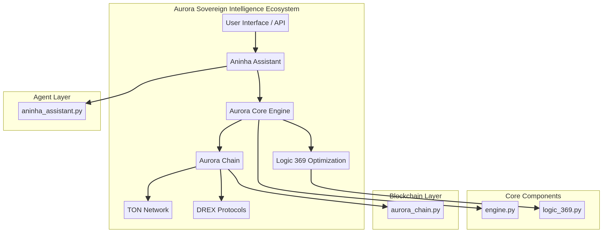

# Aurora Sovereign Intelligence



## English

**Developed by Felipe Marcos de Abreu Aquino**

**Sovereign Technology by Impulso Digital**

### Vision

Aurora Sovereign Intelligence represents a paradigm shift in artificial intelligence, designed to empower nations and foster technological sovereignty. Our vision is to transform Brazil into a global powerhouse, not only in natural resources but also as a creator and exporter of cutting-edge technology. By developing advanced AI solutions, we aim to unlock unprecedented potential, drive innovation, and secure a prosperous future for the nation.

### Aurora Ecosystem Architecture

The Aurora Ecosystem is built upon a modular and robust architecture, ensuring scalability, security, and high performance. Key components include:

*   **Core Engine (core/engine.py):** The heart of Aurora, featuring high-performance algorithms for data processing and intelligent decision-making.
*   **Logic 369 (core/logic_369.py):** An optimization module inspired by the universal frequency 369, enhancing efficiency and precision across all operations.
*   **Aurora Chain (blockchain/aurora_chain.py):** A secure blockchain integration layer, leveraging the TON network and DREX protocols for decentralized operations and financial technology.
*   **Aninha Assistant (agents/aninha_assistant.py):** A personalized AI assistant designed for intelligent support and management, streamlining complex tasks and interactions.

### Getting Started

#### Prerequisites
- Python 3.8+
- Docker (optional)

#### Installation
1. Clone the repository:
   ```bash
   git clone https://github.com/felipetjmg1-bit/Aurora-Sovereign-Intelligence.git
   cd Aurora-Sovereign-Intelligence
   ```
2. Run the setup script:
   ```bash
   chmod +x setup.sh
   ./setup.sh
   ```

#### Running Tests
To ensure everything is working correctly, run the automated tests:
```bash
python -m unittest discover tests
```

#### Docker Deployment
You can also run Aurora in a containerized environment:
```bash
docker build -t aurora-sovereign-intelligence .
docker run aurora-sovereign-intelligence
```

### Roadmap 2026

Our ambitious roadmap for 2026 focuses on expanding the Aurora Ecosystem's capabilities and global reach:

1.  **Phase 1: Core System Enhancement (Q1-Q2):** Further optimization of the core engine and Logic 369 module, focusing on quantum-resistant algorithms and enhanced predictive analytics.
2.  **Phase 2: Blockchain Expansion (Q2-Q3):** Deepening integration with the TON network, exploring cross-chain compatibility, and piloting DREX-based financial applications.
3.  **Phase 3: Agent Network Development (Q3-Q4):** Introducing new specialized AI agents to complement Aninha Assistant, focusing on areas like autonomous research, resource management, and secure communication.
4.  **Phase 4: International Partnerships & Deployment (Q4):** Establishing strategic alliances with international partners and initiating pilot deployments in key sectors to demonstrate Aurora's transformative power.

---

## Português

# Aurora Sovereign Intelligence


**Desenvolvido por Felipe Marcos de Abreu Aquino**

**Tecnologia Soberana da Impulso Digital**

### Visão

A Aurora Sovereign Intelligence representa uma mudança de paradigma na inteligência artificial, projetada para capacitar nações e promover a soberania tecnológica. Nossa visão é transformar o Brasil em uma potência global, não apenas em recursos naturais, mas também como criador e exportador de tecnologia de ponta. Ao desenvolver soluções avançadas de IA, pretendemos desbloquear um potencial sem precedentes, impulsionar a inovação e garantir um futuro próspero para a nação.

### Arquitetura do Ecossistema Aurora

O Ecossistema Aurora é construído sobre uma arquitetura modular e robusta, garantindo escalabilidade, segurança e alto desempenho. Os principais componentes incluem:

*   **Motor Principal (core/engine.py):** O coração da Aurora, apresentando algoritmos de alto desempenho para processamento de dados e tomada de decisões inteligentes.
*   **Lógica 369 (core/logic_369.py):** Um módulo de otimização inspirado na frequência universal 369, aumentando a eficiência e a precisão em todas as operações.
*   **Aurora Chain (blockchain/aurora_chain.py):** Uma camada de integração blockchain segura, utilizando a rede TON e os protocolos DREX para operações descentralizadas e tecnologia financeira.
*   **Aninha Assistant (agents/aninha_assistant.py):** Uma assistente de IA personalizada projetada para suporte e gerenciamento inteligentes, simplificando tarefas e interações complexas.

### Primeiros Passos

#### Pré-requisitos
- Python 3.8+
- Docker (opcional)

#### Instalação
1. Clone o repositório:
   ```bash
   git clone https://github.com/felipetjmg1-bit/Aurora-Sovereign-Intelligence.git
   cd Aurora-Sovereign-Intelligence
   ```
2. Execute o script de configuração:
   ```bash
   chmod +x setup.sh
   ./setup.sh
   ```

#### Executando Testes
Para garantir que tudo está funcionando corretamente, execute os testes automatizados:
```bash
python -m unittest discover tests
```

#### Deploy com Docker
Você também pode executar a Aurora em um ambiente de contêiner:
```bash
docker build -t aurora-sovereign-intelligence .
docker run aurora-sovereign-intelligence
```

### Roadmap 2026

Nosso ambicioso roadmap para 2026 foca na expansão das capacidades e alcance global do Ecossistema Aurora:

1.  **Fase 1: Aprimoramento do Sistema Central (Q1-Q2):** Otimização adicional do motor principal e do módulo Lógica 369, com foco em algoritmos resistentes a quantum e análise preditiva aprimorada.
2.  **Fase 2: Expansão Blockchain (Q2-Q3):** Aprofundamento da integração com a rede TON, exploração da compatibilidade entre cadeias e pilotagem de aplicações financeiras baseadas em DREX.
3.  **Fase 3: Desenvolvimento da Rede de Agentes (Q3-Q4):** Introdução de novos agentes de IA especializados para complementar a Aninha Assistant, com foco em áreas como pesquisa autônoma, gerenciamento de recursos e comunicação segura.
4.  **Fase 4: Parcerias Internacionais e Implantação (Q4):** Estabelecimento de alianças estratégicas com parceiros internacionais e início de implantações piloto em setores-chave para demonstrar o poder transformador da Aurora.
